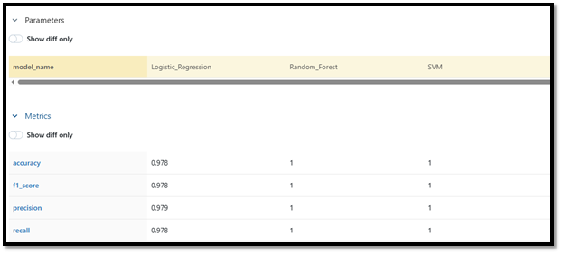
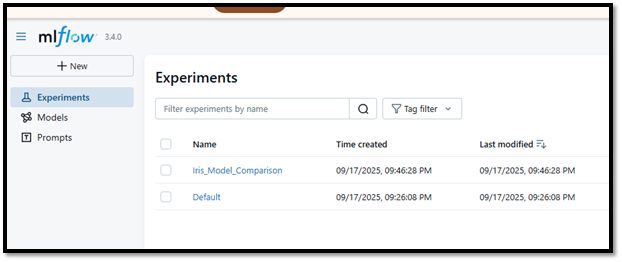
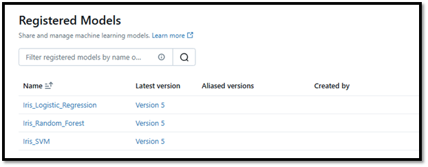
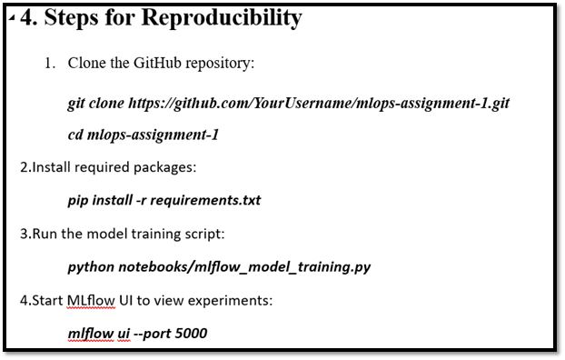

# GitHub Basics and MLflow Tracking

## Project Description
This project demonstrates the training, evaluation, and comparison of multiple machine learning models on the Iris dataset. It also includes experiment tracking, model logging, and model registration using **MLflow**.

The main objectives are:
- Use GitHub for version control and collaboration.
- Train and compare multiple ML models (Logistic Regression, Random Forest, SVM).
- Log experiments, metrics, and models using MLflow.
- Demonstrate model registration in MLflow Model Registry.
- Ensure reproducibility of the workflow.

---

## Project Structure
mlops-assignment-1/
├── data/ # Dataset files
├── notebooks/ # Training scripts / notebooks
├── src/ # Helper functions / source code
├── models/ # Saved ML models (.pkl)
├── results/ # Screenshots, logs, reports
└── README.md # Project documentation

---

## Dataset
- Dataset used: **Iris.csv**
- Columns:
  - `SepalLengthCm`, `SepalWidthCm`, `PetalLengthCm`, `PetalWidthCm` (features)
  - `Species` (target)
- Dataset shape: `(150, 6)`  

---

## Model Training and Comparison

### Models Trained:
1. Logistic Regression
2. Random Forest
3. Support Vector Machine (SVM)

### Metrics Used:
- Accuracy
- Precision
- Recall
- F1-Score

### Sample Results (from MLflow experiment):

| Model                 | Accuracy | Precision | Recall | F1-Score |
|-----------------------|----------|-----------|--------|----------|
| Logistic Regression   | 1.000    | 1.000    | 1.000  | 1.000    |
| Random Forest         | 1.000    | 1.000     | 1.000  | 1.000    |
| SVM                   | 1.000    | 1.000     | 1.000  | 1.000    |

> Note: Accuracies vary due to different train-test splits.

---

## MLflow Tracking
- **Experiment Name:** `Iris_Model_Comparison`
- **Metrics Logged:** accuracy, precision, recall, f1_score
- **Parameters Logged:** model_name
- **Models Registered:**
  - `Iris_Logistic_Regression`
  - `Iris_Random_Forest`
  - `Iris_SVM`
- **Backend Used:** SQLite (local file: `mlflow.db`)
- **Artifacts:** saved model files (`.pkl`) in `/models` folder

### Screenshots

---

## Reproducibility
1.	Clone the GitHub repository:
git clone https://github.com/iamMafiaaNawaz/mlops-assignment-1.git
cd mlops-assignment-1
2.Install required packages:
pip install -r requirements.txt
3.Run the model training script:
	python notebooks/mlflow_model_training.py
4.Start MLflow UI to view experiments:
	mlflow ui 

## GitHub Repository
 https://github.com/iamMoafiaaNawaz/mlops-assignment-1.git
